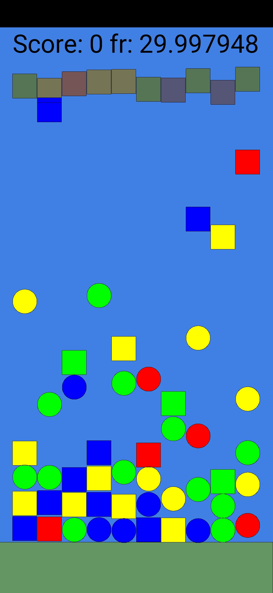
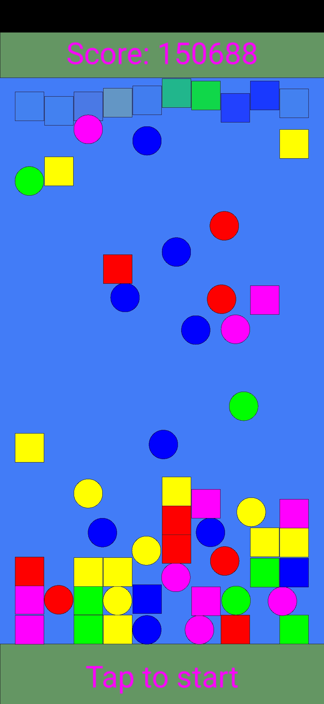

## Example BoxDrop

Inspired by 

[this topic on Processing Discourse](https://discourse.processing.org/t/processing-match-3/21507/15)

~~Cleaned up~~ Rewrote the code, somewhat, and it became a mini-game of sorts :-)

Note how the collision detection works without any grid based knowledge, could be extended to arbitrary shapes.

By and by, I might add

- [ ] Sound
- [ ] Textures
- [ ] Shapes
- [ ] 3D
- [ ] Highscores
- [ ] Instructions/credits
- [ ] ...

and explain a little bit how each step is done, making it a tutorial for simple game design with Processing.

Stay tuned. 06.06.2020

#  Step 1

Now in folder `Example 1`

and became a real little game:

# Step 2

- [x] Demo/autoplay mode
- [x] Bouncy balls
- [x] crude UI

Next? Maybe add sound.
Ploink, ploink...

---
