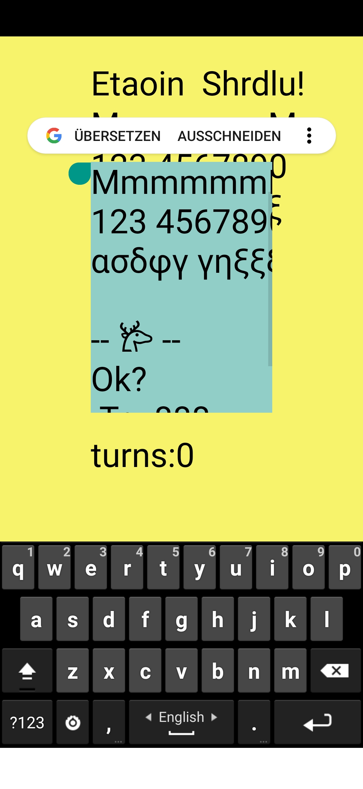

# Example BoxDrop

Inspired by 

[this topic on Processing Discourse](https://discourse.processing.org/t/processing-match-3/21507/15)

~~Cleaned up~~ Rewrote the code, somewhat, and it [became a mini-game of sorts :-\)
](#boxdrop)

# Other stuff dropped here

## Sabbatier effect

Inspired by 
https://discourse.processing.org/t/sabattier-effect-in-processing/21553

Original in `Sabbat`

And for the fun of it, I made a [GLSL shader verion. ](#GLSL)

## Android Multiline Edit

... and how to integrate it into a Processing Sketch.

Inspired by 

https://github.com/EmmanuelPil/Android-java-code-utilities-widgets-for-Processing-for-Android/issues/2

After some tinkering, it doesnt look too bad:

- All the Android niceties
  - Context menu
  - Keyboard control
  - Scrolling
  - Vertical scrollbar
  -  ... I just can't get s horizontal sb.
- Size synced with Processing
- Vertical scrollbar
- proper alignment
- Wrapped up for 'normal' Processing use (runonuithread madness).
- Minimal example without unneccessary glitzer
- and as a bonus: handling orientation changes in Processing/Android/APDE!


See `EditText2`



PS: My 'real'  version now uses a change-listener, if someone is interested, I'll post it.

----

# BoxDrop

## Step1

Now in folder `Example 1`

Note how the collision detection works without any grid based knowledge, could be extended to arbitrary shapes.

By and by, I might add

- [ ] Sound
- [ ] Textures
- [ ] Shapes
- [ ] 3D
- [ ] Highscores
- [ ] Instructions/credits
- [ ] ...

and explain a little bit how each step is done, making it a tutorial for simple game design with Processing.

Stay tuned. 06.06.2020


and It became a real little game:

## Step2

- [x] Demo/autoplay mode
- [x] Bouncy balls
- [x] crude UI


Next? Maybe add sound.
Ploink, ploink...

# GLSL

Source in `SabbatG`

@Milchreis : This might be of interest for you?

Note that it is not much longer ( if at all) than going for pixels[] from java/pde, and once written, very easy to use.

About 1000x faster, too :-).
And no copying of images.

Just so:

`sketch.pde`

```Java
/***************************************************************************************
 * Copyright (c) 2020 by the author
 * @author Ullrich Heinemann , https://github.com/uheinema
 * Released under the terms of the GPLv3, refer to: http://www.gnu.org/licenses/gpl.html
 ***************************************************************************************/

PImage pic;

PShader FILTER;

String filterFrag="sabbatierFrag310.glsl";

float aspect;
float piwi;

void setup() {
  fullScreen(P3D);
  pic=loadImage("manray.png");
  piwi=width;
  aspect=1.0*pic.height/pic.width;
  if (aspect>1) piwi/=aspect;
  
  FILTER=loadShader(
     filterFrag,
     "FilterVert310.glsl"
    );
}

void draw() {
  background(frameCount);
  image(pic, 0, 10, piwi, piwi*aspect);
  g.shader(FILTER);
  FILTER.set("limit",(float)(frameCount%500)/500.0);
  image(pic, 0, 20+piwi*aspect, piwi, piwi*aspect);
  g.resetShader();;
}
```

`sabbatierFrag310.glsl`

```GLSL

#version 310 es

#ifdef GL_ES
precision mediump float;
precision mediump int;
#endif

#define PROCESSING_TEXTURE_SHADER

in vec4 vertTexCoord;
out vec4 out_gl_FragColor;

uniform sampler2D texMap;
uniform float limit; // 0.0f if not initialized?

// from https://github.com/msfeldstein/glsl-map/blob/master/index.glsl
float map(float value, float inMin, float inMax, float outMin, float outMax) {
  return outMin + (outMax - outMin) * (value - inMin) / (inMax - inMin);
}

// -------
// copied (almost) verbatim from java
float sabbatier(float u) {
  float lim=0.2f;
  float r;
  if(limit!=0.0f) lim=limit;
  if (u<lim) // in glsl, some ramp would be even faster
    r=map(u, 0.0, lim, 1.0, 0.0);
  else
    r=map(u, lim, 1.0, 0.0, 1.0);
  return r;
}
//-------

void main() {  
  vec2 p = vertTexCoord.st;
  out_gl_FragColor =vec4( vec3(sabbatier(texture(texMap,p).b)),1.0);
}

```

and finally
 `FilterVert310.glsl` :

```glsl
#version 310 es

#ifdef GL_ES
precision mediump int;
#endif

uniform mat4 transformMatrix;
uniform mat4 texMatrix;

in vec4 position;
in vec2 texCoord;

out vec4 vertTexCoord; // keep at 4 for minimal 110 compat
// and gl_Position...

void main() {
  gl_Position = transformMatrix * position; // must be
  vertTexCoord = 
    texMatrix *  // leave out to turn upside down...why not
         vec4(texCoord, 1.0, 1.0);
}

```

Enjoy...

09.06.2020

---
